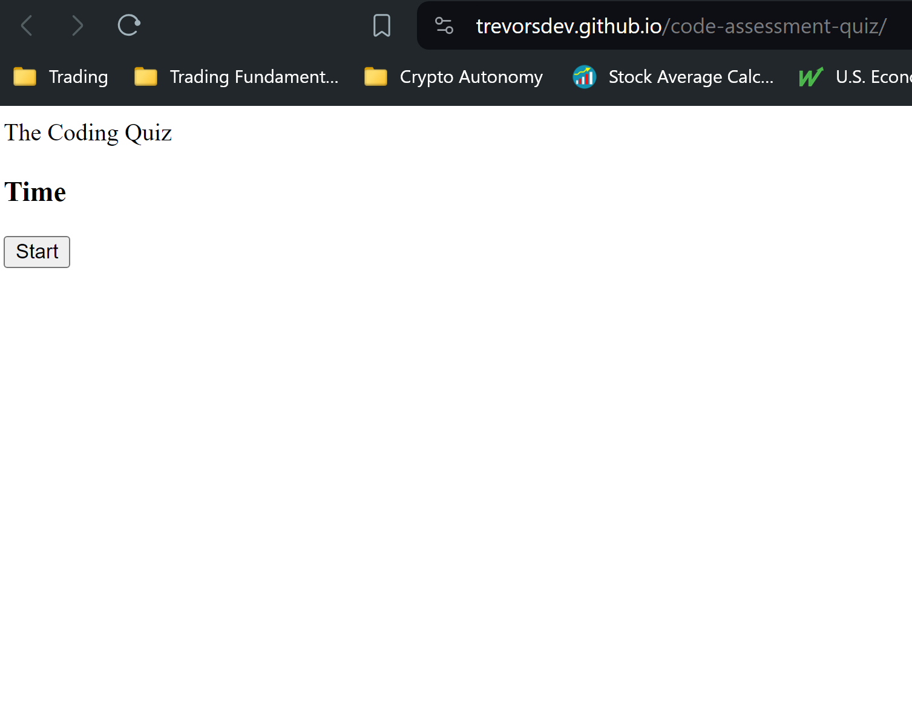

# Code-Assessment-Quiz

LINK TO DEPLOYED APPLICATION: https://trevorsdev.github.io/code-assessment-quiz/

## Discription
This project is a timed coding quiz. Its designed to test your knowledge and understanding of Web Development in this case. However, its questions and answers can be restructured and presented for any topic. This is a multiple choice quiz that has a sixty second timer which begins the moment you click the start button. For each question thats answered incorrectly, time is docked from the sixty second timer. When all of the questions are answered, or when the clock reaches zero, the game ends. At the end of the game you will be able to save your score to the browsers local database.

## Table of Contents

- [Installation](#installation-processes)
- [Usage](#app-usage)
- [License](#license)
- [contributors](#contributors)

## Installation Processes
There are no steps required to run this project. Viewing the deployed website link is all you need to run the application

## App Usage
Follow the instructions in the description and refer to the pictures below as examples.

## License
This project is licensed under the mit.

## Contributors
All contributions were made by the teachers, TAs, and tutors from ASU's Web Development Program.

## Questions
If you have any questions about this project please email me at: Trevor9J@Protonmail.com. If you want to see more of my work, please visit my [GitHub](https://github.com/TrevorsDev). If you would like to view this project directly, please visit the repository: https://github.com/TrevorsDev/code-assessment-quiz
